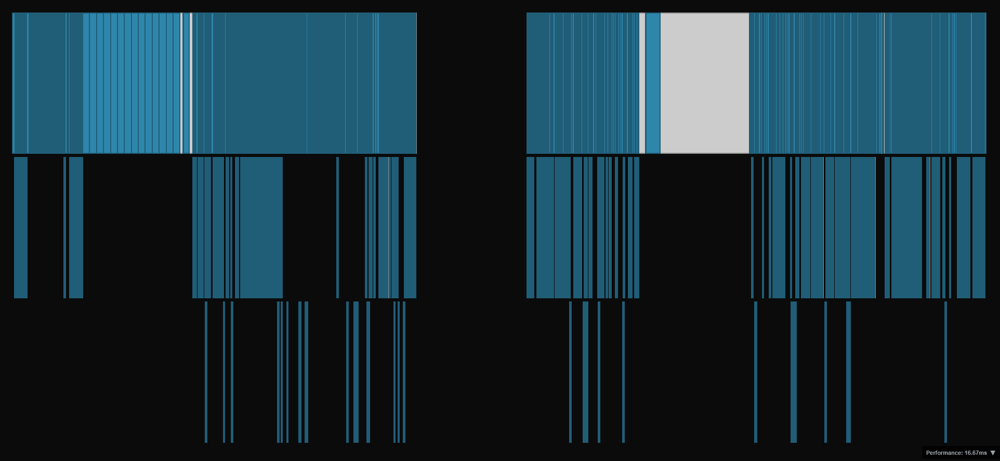

# PoolViz



A high-performance memory pool visualizer built with React and PIXI.js. PoolViz provides an interactive visualization of memory allocation patterns across multiple layers of segment heap.

Initially it was developed as a tool for exploit development, particularly for debugging different heap shaping issues.

> PoolViz was created with assistance of GitHub Copilot and Claude Sonnet 4.5. (Because reverse-engineers are often not good enough with web technology stack ^_^ )

Features:
* Visual memory analysis. PoolViz allows you to see how chunks are distributed at different levels.
* High Performance. PoolViz renders millions of chunks in hundreds of ms.

The app accompanied with PoC extension for saving pool chunks from WinDBG kernel session. You may found script [here](./scripts/windbg/README.md)

## Performance

PoolViz uses several optimization techniques:

- Binary search for visible blocks (O(log n) instead of O(n))
- Run-length encoding for rectangle merging
- Level of Detail (LOD) system for adaptive rendering


## Installation

Install node.js dependencies.

```bash
npm install
```

Run PoolViz locally or build it and publish wherever you want.
```bash
npm run dev
npm run build
npm run preview
```

## License

AS IS

## Contributing

Feel free to submit a Pull Request.
